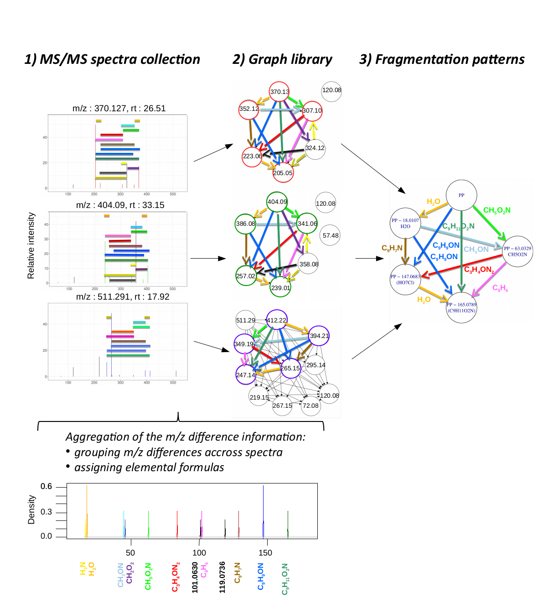
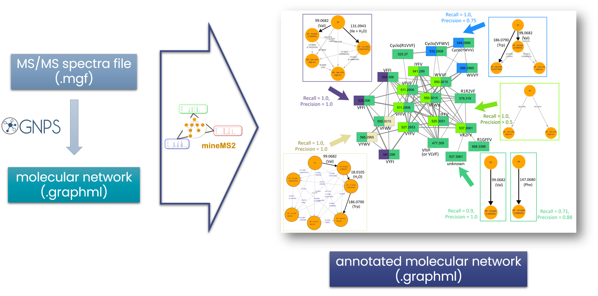

# mineMS2: Annotation of spectral libraries with exact fragmentation patterns

<!-- badges: start -->

[](https://app.codecov.io/gh/odisce/mineMS2)

<!-- badges: end -->

[](https://github.com/odisce/mineMS2/actions/workflows/R-CMD-check.yaml)

## Description

The **search for similarities within a collection of MS/MS spectra** is a powerful approach to facilitate the identification of new metabolites (Beniddir *et al.*, 2021). *mineMS2* implements an innovative strategy to **extract frequent fragmentation patterns containing shared m/z differences** between subsets of the spectra (Delabrière *et al.*, 2025). This method is based on:

1.  a **new representation of spectra as *fragmentation graphs* of m/z differences**

2.  an efficient **frequent-subgraph mining** algorithm to extract patterns



Each **pattern is a graph** with **ion peaks as nodes** and **m/z differences as edges**. These m/z differences can be **any difference between the m/z values of two peaks of a spectrum**, provided that they are **frequent** (i.e. detected in at least two spectra). They therefore include **not only neutral losses but also m/z differences between ions that belong to distinct fragmentation paths** of the precursor, which may also prove specific to the fragmentation of specific molecules. The candidate **molecular formulas for each m/z difference** are computed to help interpretation (below 200 Da).

*mineMS2* patterns are **complementary to those of MS2LDA** (van der Hooft *et al.*, 2016), the latter consisting of a list of neutral fragments and losses and being obtained using a probabilistic approach. In particular, the **structure of *mineMS2* patterns in the form of exact graphs** (all m/z differences of the pattern are present in all spectra containing this pattern) **facilitates their chemical interpretation**.

*mineMS2* can be further **coupled to the GNPS MS/MS molecular networking** methodology (Watrous *et al.*, 2012) to **focus on patterns that best explain components** of the network.



## Installation

The package can be installed from GitHub with:

``` r
#install.packages("devtools")
devtools::install_github("odisce/mineMS2")
```

## Tutorials (vignettes)

Two vignettes detail how to **compute and explore the fragmentation patterns** ([vignettes/mineMS2_main.html](https://htmlpreview.github.io/?https://github.com/odisce/mineMS2/blob/master/vignettes/mineMS2_main.html)) and how to **focus on the patterns that best explain components of the molecular network** ([vignettes/mineMS2_coupling-to-gnps.html](https://htmlpreview.github.io/?https://github.com/odisce/mineMS2/blob/master/vignettes/mineMS2_coupling-to-gnps.html)).

## Dataset

The included dataset, which is used in the examples and vignettes, consists of **51 spectra** from the untargeted study of the **secondary metabolism of *Penicillium nordicum*** (Hautbergue *et al.*, 2019).

## Citation

Delabrière A., Gianfrotta G., Dechaumet S., Damont A., Hautbergue T., Roger P., Jamin E.L., Puel O., Junot C., Fenaille F. and Thévenot E.A. (2025) mineMS2: Annotation of spectral libraries with exact fragmentation patterns. *ChemRxiv*, Preprint. [DOI:10.26434/chemrxiv-2025-3c9z1](https://doi.org/10.26434/chemrxiv-2025-3c9z1).

## Contacts

[alexis.delabriere\@hotmail.fr](mailto:alexis.delabriere@hotmail.fr), [coline.gianfrotta\@cea.fr](mailto:coline.gianfrotta@cea.fr), and [etienne.thevenot\@cea.fr](mailto:etienne.thevenot@cea.fr)

## Licence

[CeCILL V2.1](https://cecill.info/licences/Licence_CeCILL_V2.1-en.html)

## References

Beniddir,M.A. *et al.* (2021) Advances in decomposing complex metabolite mixtures using substructure- and network-based computational metabolomics approaches. *Nat. Prod. Rep.*, **38**, 1967–1993. [DOI:5B10.1039/D1NP00023C](https://doi.org/10.1039/D1NP00023C).

Hautbergue,T. *et al.* (2019) Combination of isotope labeling and molecular networking of tandem mass spectrometry data to reveal 69 unknown metabolites produced by penicillium nordicum. *Analytical Chemistry*, [DOI:5B10.1021/acs.analchem.9b01634](https://doi.org/10.1021/acs.analchem.9b01634).

van der Hooft,J.J.J. *et al.* (2016) Topic modeling for untargeted substructure exploration in metabolomics. *Proceedings of the National Academy of Sciences*, **113**, 13738–13743. [DOI:B10.1073/pnas.1608041113](https://doi.org/10.1073/pnas.1608041113).

Watrous,J. *et al.* (2012) Mass spectral molecular networking of living microbial colonies. *Proceedings of the National Academy of Sciences*, **109**, E1743–E1752. [DOI:10.1073/pnas.1203689109](https://doi.org/10.1073/pnas.1203689109).
