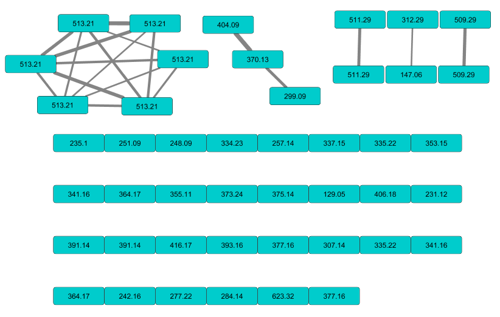

```{r setup, include=FALSE}
knitr::opts_chunk$set(echo = TRUE)
```


# Introduction

This vignette highlights the use of the _MineMS2_ software coupled to the GNPS MS-MS networking methodology. The GNPS network may be generated directly from the *ex_mgf.mgf* file present in the *dataset* subdirectory of your _MineMS2_ installation. In this example the GNPS network has been precomputed on the GNPS website and extracted, the *.graphML* file  *ex_gnps_network.graphml* is present inside the *dataset* subdirectory. I strongly recommend to compute the patterns and the GNPS network on the same .mgf file to avoir matching issues.


# Pre-requisites

##Dataset
The considered dataset is a dataset of Penicillium verrucosum and is a subset of the 98 metabolites extracted from the study described in @Hautbergue2017 . All the spectra for which an MS signal wasdetected by the MzMine software [@Pluskal2010] in positive mode and for which an MS-MS spectra at HCD20 were extracted, resulting in 45 MS-MS spectra.


##Initialisation
The initialization loads the required pakages and extract the data paths.
```{r path_gnps}
library(mineMS2)
path_demo <- system.file("dataset",package="mineMS2")
path_network <- file.path(path_demo,"ex_gnps_network.graphml")
path_mgf <- file.path(path_demo,"ex_mgf.mgf")
path_supp_info <- file.path(path_demo,"ex_supp_infos.csv")
```

## Patterns computation.
The patterns computations step is described in more detail in the [MineMS2 main vignette] (mineMS2-vignette.html), therefore it not discussed in detail there.
```{r pattern_computing,message=FALSE}
supp_infos <- read.table(path_supp_info,header=TRUE,sep=";")

###Sepctra are read and thresholded.
m2l <- ms2Lib(path_mgf,suppInfos = supp_infos, intThreshold = 3000)

###An ID is added to each spectra.
infos <- getInfo(m2l,"S")
ids <- paste(paste("MZ",infos[,"mz"],sep=""),paste("RT",infos[,"rt"],sep=""),sep="_")
m2l <- setIds(m2l,ids)


###Dags are created.
m2l <- discretizeMassLosses(m2l,dmz = 0.008,ppm=8,heteroAtoms=FALSE,maxFrags=15)

###Patterns are detected.
m2l <- mineClosedSubgraphs(m2l,sizeMin=1,count=2)
```
The resulting includes `r length(m2l)` subgraphs. In the rest of this vignette we will highlights how the funished methodology may be used to extract patterns explaining GNPS components.


#Coupling MineMS2 with GNPS

##Reading the GNPS network
The GNPS network may be read using the *igraph* package :
```{r gnps_network_reading}
library(igraph)

net_gnps <- read_graph(path_network, "graphml")
```

However to avoid the inclusion of meaningless components, we start by removing the self-edges which are added by GNPS, this can be done using the _simplify_ function form the igraph package.

```{r simplify_network}
net_gnps <- simplify(net_gnps,remove.multiple = FALSE,edge.attr.comb = "ignore")
```


An overview of the GNPS network after this processing is shown here, generated using the cytoscape software (@Shannon2003) :


```{r net_raw, out.width = "500px",fig.align = 'center',echo=FALSE}

```


After this step the GNPS network may be annotated using the patterns extracted by mineMS2.

## Extracting components from an MS-MS network.

Then the connected components and the cliques may be extracted using the *findGNPSComponents* function. The important parameters of this function are the _minSize_ parameter which idicate the minimum size of the detected cliques and the _pairThreshold_ threshold which indicate a similarity threshold for which an exaplantion of a single edge is generated.
```{r gnps_components}
components <- findGNPSComponents(net_gnps,minSize=3,pairThreshold = 0.9)
```
The results of this function is a list of graph components which could potentially be explained by a pattern.

## Finding patterns explaining components.

MineMS2 implement a matching between components and subgraphs occurences using metrics related to binary classification, notably the _recall_, the _precision_ and the _F1-score_ [(more information)](https://en.wikipedia.org/wiki/F1_score). The pattern maximizing the given metric are returned, in case of tie a second metrics may be used. In the case of GNPS matching a we set the metric argument to `c("recall","accuracy","size")` to indicate that a pattern maximizing recall is extracted for each components, accuracy and size and then used to split tie. This will reduce the number of explaining pattern to 1 by component in general.
```{r patterns_explaining_components}
patterns <- findPatternsExplainingComponents(m2l,components,metric=c("recall","precision","size"))
```

The returned quantity is a list which include all the metrics for the given patterns, aswell as the id of the found explaining patterns.
```{r pattern_showing}
patterns[[1]]
```
The found ids can then be extracted using th id method. `r ids <- sapply(patterns,'[',i=1,j="id")`.


These patterns can then be observed using the _plot_ and _plotOccurences_ functions, which are wrapped inside the _plotPatterns_ function for commodity purpose. This function may be easely coupled to a pdf output.
```{r pattern_plotting, fig.align='center'}
###Here a single id is selected for lisibility purpose.
plotPatterns(m2l,patterns[[4]][,"id"],components = components[4])
```

The network may then be directly annotated using the _annotateNetwork_ function.

```{r annotate_network}
annotated_net <- annotateNetwork(components,net_gnps,patterns)
```

The graph can then be exported using the _write\_graph_ function from the igraph package.
```{r export_graph,eval=FALSE}
write_graph(graph = annotated_net,format = "graphml",file = "ex_annotated_gnps_network.graphml")
```
This network can be visualized in cytoscape :
```{r net_annotated, out.width = "500px",fig.align = 'center',echo=FALSE}
knitr::include_graphics("figures/annotatedGNPS.png")
```
The _colorComponents_ attribute is designed to be used in the enhancedGraphics GNPS package to visualize the explained components. Each components correspond ot a color, and multiply colored nodes indicates vertices present in multiples components.

##Going further than GNPS
While the use of GNPS allows a quick first pass processing of many interesting nodes, the use of *mineMS2* in a more exploratory way allow the discovery of supplementary information. The pattern found explaining the biggest components composed of isomeric compounds with m/z _513.21_   is `r patterns[[1]][,"id"]` as it visible in the network. We can plot this pattern using the *plotPatterns*
```{r P5,fig.align = "center"}
id_pat <- patterns[[1]][,"id"]
plotPatterns(m2l,id_pat)
```

We first an explanation of this fragmentation pattern, the 6 molecules all loses an $NH_3$. This single $NH_3$ loss is also observed in many different spectra, and is representative of an amine loss. One may also be interested into very specific fragmentation similarity, for exampled by looking at the similrity between vertices with mz $404.09$ and $370.13$, this high similarity is explained by components $4$

```{r Pochratoxins,fig.align = "center"}
id_pat <- patterns[[4]][,"id"]
plot(m2l,id_pat)
```

In this pattern, we notably spot a loss with a mass differences of $147.068$, the information on this neutral loss, may notbaly be found using *findMz* and *getInfo* functions.
```{r loss_phenylalanine}
L147 <- findMz(m2l,147.068,ppm=8,dmz=0.005,type="L")
getInfo(m2l,L147)

```
One possible formula for the loss is $C_9H_9NO$, which corresponds to a phenyalanine loss. It is possible to look for this loss in other patterns using the *select* functions :
```{r other_phenyalanine}
ids_phenylalanine <- select(m2l,L147,"P")
ids_phenylalanine
```
By plotting patterns `r ids_phenylalanine[[1]][10]` using the plotPatterns function :
```{r phenyalanine, fig.align="center"}
plotPatterns(m2l,ids_phenylalanine[[1]][10])
```

One find a similarity of decomposition notably inclusing an $H_2O$,$CH3NO$ and $147.068$ which indicate a a common amino acid structure aswell as a phenyalanine loss. This similariy is totally ignored by GNPS, but may be found using the mineMS2 software.

#Bibliography
