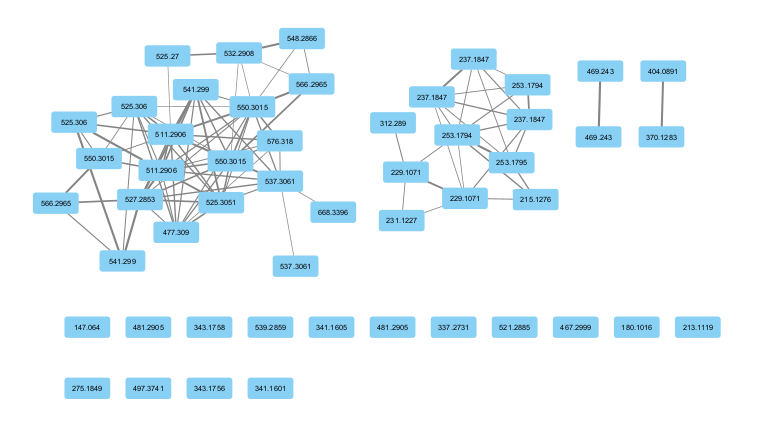
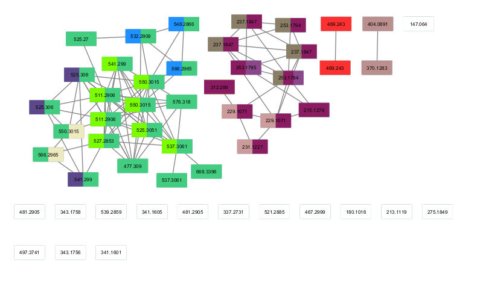
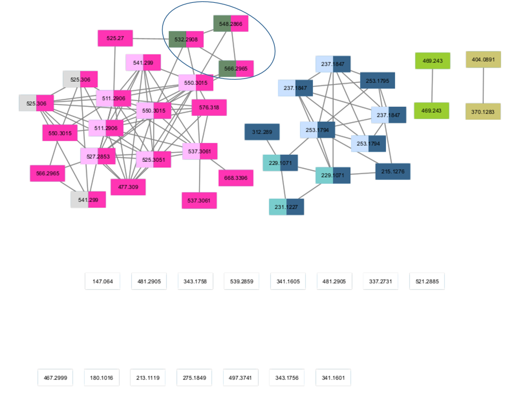
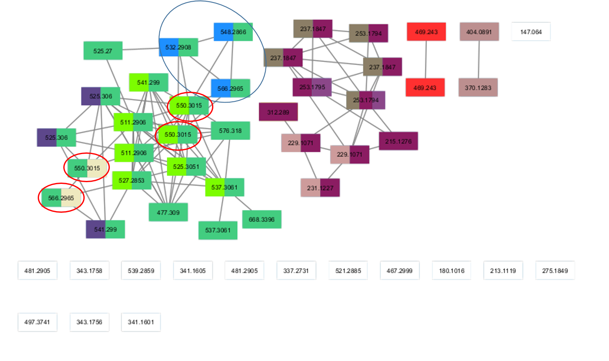

```{r setup, include=FALSE}
knitr::opts_chunk$set(echo = TRUE)
knitr::opts_chunk$set(fig.path = "figures/")
```

# Introduction

This vignette describes the use of the _mineMS2_ software coupled to the GNPS MS/MS molecular networking methodology [@Watrous2012]. In this example, the molecular network has been precomputed on the GNPS website and extracted in the *.graphML* format (file  *graph_gnps_pnordicum.graphml* inside the *dataset* subdirectory of the _mineMS2_ installation folder). We strongly recommend to compute the patterns and the GNPS network on the same .mgf file to avoid matching issues.

# Pre-requisites

## Dataset

Secondary metabolites of *Penicillium nordicum* have been studied by Data Dependent Acquisition [@Hautbergue2019]. The subset of 51 MS/MS spectra provided in the package corresponds to the spectra at the HCD20 energy with an associated MS signal in positive mode.

## Initialization

The initialization loads the required packages and extracts the data paths.

```{r path_gnps}
if (!require(mineMS2)) install_github("odisce/mineMS2")
library(mineMS2)

path_demo <- system.file("dataset",package = "mineMS2")
path_network <- file.path(path_demo, "graph_gnps_pnordicum.graphml")
path_mgf <- file.path(path_demo, "dda_msms_pnordicum.mgf")
path_supp_info <- file.path(path_demo, "dda_msms_pnordicum_supp.csv")
```

## Patterns mining

The pattern mining step is detailed in the [mineMS2 main vignette](main-minems2.html). Briefly, 
1. all m/z differences within the spectra are computed, 
2. a graph representation of each MS/MS spectrum using the m/z differences as edges is built (Directed Acyclic Graph, DAG), and 
3. the DAGs are mined to extract frequent patterns.

```{r pattern_computing,message=FALSE}
supp_infos <- read.table(path_supp_info, header = TRUE, sep = ";")

### Sepctra are read and thresholded
m2l <- ms2Lib(path_mgf,suppInfos = supp_infos)

### An ID is added to each spectra
infos <- getInfo(m2l,"S")
ids <- paste(paste("MZ",infos[,"mz"]), paste0("RT",infos[,"rt"]), sep = "_")
m2l <- setIds(m2l,ids)

### DAGs are created
m2l <- discretizeMzDifferences(m2l, dmz = 0.007, ppm = 15, maxFrags = 15)

### Patterns are detected
m2l <- mineClosedSubgraphs(m2l, sizeMin = 1, count = 2)
```
A total of `r length(m2l)` patterns (i.e. fragmentation subgraphs) were detected.

In the rest of this vignette, we show how these patterns can be used to interpret the components of molecular networks generated by GNPS.

# Coupling mineMS2 to GNPS

## Loading the GNPS network

The GNPS network may be read using the *igraph* package:
```{r gnps_network_reading, warning=FALSE, message=FALSE}
library(igraph)

net_gnps <- read_graph(path_network, "graphml")
```


Since self-edges (i.e. single loops) are automatically added by GNPS to single nodes, we use the _simplify_ function from the *igraph* package to remove these edges.
We also use the _as.undirected_ function to remove edge directions.

```{r simplify_network}
net_gnps <- simplify(net_gnps, remove.multiple = FALSE, edge.attr.comb = "ignore")
net_gnps <- as.undirected(net_gnps, mode = "collapse")
```

An overview of the GNPS network after this processing is shown below (as visualized with the Cytoscape software [@Shannon2003]):

```{r net_raw, out.width = "500px", fig.align = 'center', echo=FALSE}

```

The *mineMS2* patterns can be used to give an interpretation of the components of this network. 

## Extracting components from a molecular network

The components of the network we consider in *mineMS2* are the following:
- the connected components of the graph (subgraphs in which any two nodes are connected by a path), 
- the cliques (subgraphs in which any all pairs of nodes are connected), 
- the high similarity pairs of nodes (the pairs of spectra with a cosine score superior to a threshold)

It can be noted that the algorithm does not calculate all the cliques of the network. 
It computes a set of disjoint cliques (i.e. cliques without any nodes in common) to cover the graph.
It starts by a first clique which is the biggest one, then searches for the biggest clique that does not contain any node of this first clique, and so on until no clique can be found any more.

If these selected cliques contains high similarity pairs, the pairs are not considered as such. Are only considered high similarity pairs including at least one node, that does not belong to a clique.

All these components may be extracted using the *findGNPSComponents* function. 
The important parameters of this function are 
1. the _minSize_ parameter, which indicates the minimum size of the detected cliques, and 
2. the _pairThreshold_ threshold, which indicates a cosine score threshold for which an explanation of a single pair of nodes is generated.

More technically, the parameters _vname_ and _eattr_ indicate the labels of the GNPS graph attributes corresponding to node ids and edge cosine score values respectively.
```{r gnps_components}
#components <- findGNPSComponents(net_gnps, minSize = 3, pairThreshold = 0.8, vname = "shared name", eattr = "cosine_score")
components <- findGNPSComponents(net_gnps, minSize = 3, pairThreshold = 0.9, vname = "cluster index", eattr = "EdgeScore")
```


## Finding patterns explaining the extracted components

*mineMS2* implements a matching between components and subgraphs occurrences using metrics related to binary classification, including the _recall_, the _precision_ and the [_F1-score_](https://en.wikipedia.org/wiki/F1_score). The patterns maximizing the given metric are returned; in case of a tie, a second metric may be used. 
In the case of GNPS interpretation, we set the metric argument to `c("recall","precision","size")` to indicate that a pattern maximizing recall is extracted for each component, precision and size being then used to split ties. This will reduce the number of explaining patterns to 1 in most cases.
We can however choose to return one or more than one best explaining pattern(s) for each component, ordered by decreasing metric value, with the argument *top*.

```{r patterns_explaining_components}
patterns <- findPatternsExplainingComponents(m2l, components, metric = c("recall", "precision","size"), top = 5)
```

The returned list includes all the metric values for the selected patterns.
For example, here the result for the component composed of 2 metabolites, with precursor m/z values of $370.1283$ and $404.0891$ respectively.

```{r pattern_showing}
patterns[[8]]
```

The ids of the best pattern for all the components can then be extracted: `r sapply(patterns,'[',i=1,j="id")`.

These patterns can be viewed using the _plot_ and _plot\_pattern\_ggplot_ functions, which are wrapped inside the _plotPatterns_ function for convenience. 
This function also generates information about the spectra and the m/z differences in the pattern. 
the *infos_col* parameter is used to select the spectra information to be included. If NULL, all the available information will be displayed. 
It may be used to generate a pdf output (*export_pdf* argument).
```{r pattern_plotting, fig.align='center', results = 'asis'}
### Here a single id is selected for clarity.
plotPatterns(m2l,patterns[[8]][1,"id"], infos_col = c("mz.precursor", "rt", "Name"), export_pdf = FALSE)
```

The network may be directly annotated using the _annotateNetwork_ function.
The annotation includes for each node:
- the component(s) to which it belongs
- the corresponding best pattern id 
- the metrics values for each couple (component, pattern) involved

```{r annotate_network}
annotated_net <- annotateNetwork(components, net_gnps, patterns)
```

The annotated network can be exported using the _write\_graph_ function from the *igraph* package.

```{r export_graph,eval=FALSE}
write_graph(graph = annotated_net, format = "graphml", file = "inst/dataset/annotated_gnps_network_pnordicum.graphml")
```

This network can be visualized in Cytoscape (note that the GraphML format is supported by Cytoscape 3: select 'File > Import > Network from file'; with Cytoscape 2, the GraphMLReader plugin is needed):

```{r net_annotated, out.width = "500px",fig.align = 'center',echo=FALSE}

```

To visualize the colors, the _enhancedGraphics_ App from Cytoscape is required ('Apps > Install Apps > Search: enhanced Graphics'). Then, in the _Style_ tab from the _Control Panel_, select for the _Image/Chart 1_ the _Column: colorComponents_ and the _Mapping Type: Passthrough Mapping_. Each component is assigned a color; nodes with several colors belong to several components.

## Interpreting the components in terms of fragmentation patterns

We can now interpret the molecular network in terms of fragmentation patterns.

First, we investigate the best pattern explaining the biggest component, which is `r patterns[[6]][1,"id"]`.
We can plot this pattern using the *plotPatterns* method:
```{r P5, warning=FALSE, fig.align = "center", results = 'asis', fig.height = 6, fig.width = 7}
id_pat <- patterns[[6]][1,"id"]
plotPatterns(m2l, id_pat ,infos_col = c("mz.precursor", "rt", "Name"), export_pdf = FALSE)
```

This component is composed of 21 spectra, and we see that 19 out of the 21 fragmentation spectra share a m/z difference of $99.0683$, that is not present in any other spectra in the dataset (precision = 1).
The proposed formula for this m/z difference are $H_9O_3N_3$, $C_5H_9ON$ and $C_2H_{13}ONS$.
In particular, $C_5H_9ON$ could correspond to a loss of valine, which is consistent with the metabolites of this component, that are tetrapeptides composed notably of valine residues.

As another example, within this connected component, the circled clique in the figure below is explained by a larger pattern.

```{r net_annotated_clique, out.width = "500px",fig.align = 'center',echo=FALSE}

```

```{r clique, results = 'asis', warning = FALSE}
  id_pat <- patterns[[4]][1,"id"]
  plotPatterns(m2l, id_pat ,infos_col = c("mz.precursor", "rt", "Name", "peptide.formula"), export_pdf = FALSE)  
```

This pattern especially contains a m/z difference of $186.079$, with the possible formula $C_{11}H_{10}ON_2$, that can correspond to a loss of tryptophane, which is part of the concerned metabolites.


## Beyond molecular networks: discovering new similarities between spectra

The patterns also help discovering new similarities between spectra. Getting back to the $186.079$ m/z difference above, it is now possible to look for this loss in other patterns using the *select* function:

```{r other_phenyalanine}
L186 <- findMz(m2l, mz = 186.079, ppm = 15, dmz = 0.01, type = "L")
ids_tryptophane <- select(m2l, L186, "P")
ids_tryptophane
```


Several other patterns thus contain this m/z difference: `r ids_tryptophane[[1]]`

They can be visualized using *plotPatterns*.
For example, the `r ids_tryptophane[[1]][8]` pattern:

```{r phenyalanine, fig.align="center", results = 'asis', warning = FALSE}
plotPatterns(m2l,ids_tryptophane[[1]][8], infos_col = c("mz.precursor", "rt", "Name", "peptide.formula"))
```

This pattern is included in 7 spectra, that are not all linked together in the GNPS network, but that were identified by the authors of [@Hautbergue2019] as tetrapeptides containing a tryptophan residue. 

```{r net_annotated_pattern, out.width = "500px",fig.align = 'center',echo=FALSE}

```

We thus observe that in addition to the similarity of spectra at m/z $532.09$, $548.28$ and $566.29$ showed in the molecular network, *mineMS2* highlights 4 other metabolites which share the same pattern (circled in red in the figure above), including the $186.079$ loss.

This similariy is not found by GNPS, maybe for threshold reasons, but is detected by the mineMS2 software.

# References


```{r, echo = FALSE, include = FALSE}
  lab_phe <- 187
  lab_phe_h2o <- 201
  lab_val <- 125
  lab_val_h2o <- 153
  lab_ile <- 142
  lab_ile_h2o <- 172
  lab_tyr <- 199
  lab_tyr_h2o <- 199
  lab_trp <- 215
  lab_trp_h2o <- 226

    list_val_phe <- c()
  for(p in mm2Patterns(m2l))
  {
    graph <- mm2Graph(p)
    if(any(edge_attr(graph, name="lab") == lab_val) & any(edge_attr(graph, name = "lab") == lab_phe))
    {
      if(!(mm2Name(p) %in% list_val_phe))
      {
        list_val_phe <- c(list_val_phe, mm2Name(p))
      }
    }
  }

  nb_occ <- sapply(list_val_phe, function(x){
    nrow(mm2Occurences(m2l[x]))
  })


  for(p in mm2Patterns(m2l))
  {
    graph <- mm2Graph(p)
    for(node in V(graph))
    {
      succ <- neighbors(graph, node, mode = c("out"))
      #print(succ)
      if(!is.null(succ))
      {
        for(s in succ)
        {
          edg <- get.edge.ids(graph, c(node, s), directed = TRUE)
          if(edge_attr(graph, name = "lab", index = edg) %in% c(lab_val)  || edge_attr(graph, name = "lab", index = edg) %in% c(lab_phe))
          {
            #if(edge_attr(graph, name = "lab", index = edg) == lab_ile)
            #{
            #  print(mm2Name(p))
            #}
            succ_2 <- neighbors(graph, s, mode = c("out"))
            for(s2 in succ_2)
            {
              #print(edge_attr(graph, name = "lab", index = edg_2))
              edg_2 <- get.edge.ids(graph, c(s, s2), directed = TRUE)
              if((edge_attr(graph, name = "lab", index = edg) %in% c(lab_val) && edge_attr(graph, name = "lab", index = edg_2) %in% c(lab_phe))
              || (edge_attr(graph, name = "lab", index = edg) %in% c(lab_phe) && edge_attr(graph, name = "lab", index = edg_2) %in% c(lab_val)))
              {
                print(mm2Name(p))
              }
            }
          }
        }
      }
    }

  }
```